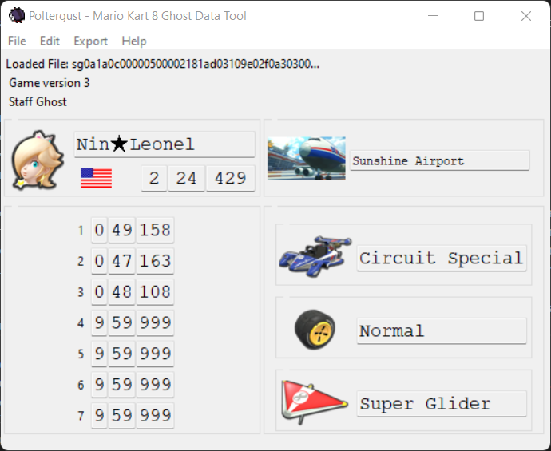

# Poltergust

Poltergust is a Mario Kart 8 U (Staff) Ghost Data visualization and (limited) modification tool. This repository also serves as documentation (through a GitHub wiki) on the file format for MK8 ghost files. Ideally this should be moved to the custom track wiki, but alas, that's currently not available.

The documentation/GitHub Wiki is a WIP, but useful things can already be derived from this tool's source code.

Contributions to code and/or documentation are always welcome.

## DISCLAIMER
This tool supports modification of ghost files, or otherwise aids in describing the file format to allow someone to perform such modifications themselves. **Under no circumstances should you upload any ghost file that was modified by this tool to the Nintendo servers**, nor should you pretend that a modified run was performed legitimately. Doing so will most likely result in a straight up ban. Furthermore, it is unsportsmanlike behaviour.

## What about Mario Kart 8 Deluxe?
I would not be surprised if Deluxe has the same file format for ghost files as Mario Kart 8 U. However, I do not have access to the game's files, nor do I even own it currently. You are free to experiment with this tool on Deluxe ghost files, and are welcome to contribute to provide support for them if there turn out to be issues.

Images for tracks, characters, and vehicle parts from Deluxe are already present in this repository, and have even already been properly mapped. Tracks from Wave I of the Booster Course Pass are the latest tracks that are present.

# Features
Poltergust supports staff ghost files, player ghost files, and (likely) downloaded ghost files. It does not support MKTV replays, as their file format is significantly different.

## Previewing
The following information can be previewed:
- Player name
- Player flag
- Racecourse
- Total time
- Individual lap times
- Character used
- Vehicle combination used

The race itself cannot be previewed.

## Mii Data
Mii data from ghost files can be extracted and replaced.

## Staff Ghosts
Player ghosts can be converted into staff ghosts.

## Future Plans
- DLC Data: Most DLC data has not yet been mapped as I haven't bothered to dump this data from my Wii U.
- Additional verification:
    - Track encoding: A track is encoded in two different ways in a ghost's filename. If they don't match up then the game will not recognise the ghost file.
    - Filename vs content: Some information is present in both the ghost's filename and its contents. Although in most cases it won't matter if these two don't match up (the filename takes precense mostly), there can sometimes be issues. For example, if the character does not match up, then animations can break when viewing the replay. See the note below.
- Extended Editing: At least the player name and flag should be editable. Support for other things can also be added, but has less priority.
- Font icons: Nintendo uses some special icons in their font, such as a ★. There is a manual translation from hex to such characters (and back), but it is by no means complete.
- Character-specific vehicle parts: Some vehicle parts are coloured differently based on the character that drives it. This is not reflected in the current UI.

# A quick note on Mario Kart 8 Ghost Data
Mario Kart 8 Ghost Data functions differently from earlier titles. In Mario Kart Wii, ghosts mimicked controller inputs to create an identical race. This could in rare cases cause desyncs, meaning that the ghost would behave differently than how the player actually raced originally.

This was fixed in Mario Kart 8, as ghost replays are no longer based on controller inputs, but instead (or also?) store the ghost's location. For example, placing ghost data from Toad Harbour over Rainbow Road will show the ghost racing through the air, following the course layout of Toad Harbour and ignoring collisions and the like from Rainbow Road entirely.

The filename of a ghost stores information such as lap times, character played, player name, player flag, etc. The information on the summary screen (i.e., the screen that is seen before watching a ghost replay) is taken directly from here. All this information is _also_ stored inside the ghost file itself. However, this is not actually used in most cases. For example, lap times on the end screen (after racing the ghost) are taken from the file contents, whereas the character and vehicle combination are still taken from the filename.

Mii data is stored inside ghost files, although it is only really used for displaying the player's name during a ghost race and on the end screen.

Ghost files were changed a little in version 4 of the game, where GCN Baby Park was added to the game. This track features seven laps that need to be stored in a ghost file name, whereas previously there was only space for at most five laps (space for two were unused). Hence, the filename of ghostfiles was extended in version 4 of the game.

# CREDITS
## Filename
Figuring out the filename was done independently, but were already confirmed earlier by lonemoonHD and Cole [in a GBATemp thread](https://gbatemp.net/threads/post-your-wiiu-cheat-codes-here.395443/page-454#post-8640417).

## Mii Data
B_squo provided the initial information on Mii data inside ghost files [in a Tweet](https://twitter.com/b_squo/status/1412392477080834056). This proved to be correct, as this data can be opened in [a Mii viewer](https://kazuki-4ys.github.io/web_apps/MiiInfoEditorCTR/).

However, editing this data directly caused the game to crash. Hence, I crosschecked Mii handling with [Mario Kart Wii ghost files](https://wiki.tockdom.com/wiki/RKG_(File_Format)) on the Custom Mario Kart Wiiki, revealing that a [CRC-16 XMODEM](https://crccalc.com/) checksum is used to ensure Mii data is not corrupted.

## Other File contents
lonemoonHD and Cole provided crucial insights [in that same GBATemp thread](https://gbatemp.net/threads/post-your-wiiu-cheat-codes-here.395443/page-454#post-8640417) regarding the difference between staff ghost data and player ghost data: the header. Copying a player ghost into a staff ghost without removing the player ghost header first caused the game to crash, but completely getting rid of this header and _then_ copying file contents over works completley fine. This provides an entrypoint for custom staff ghosts.
