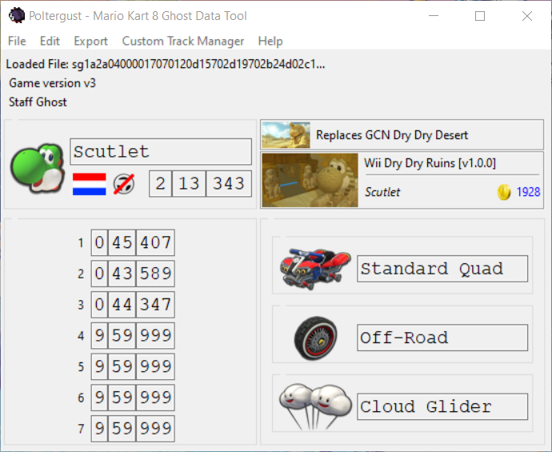
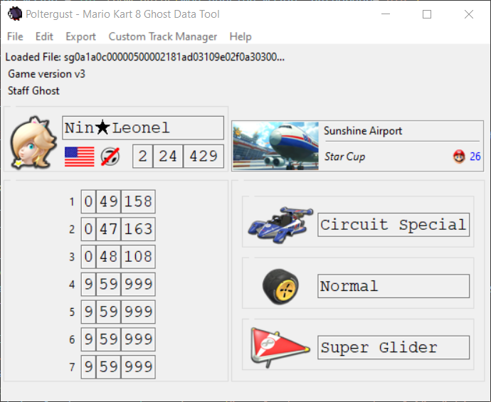
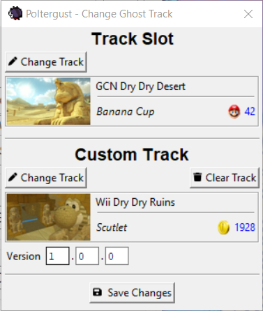
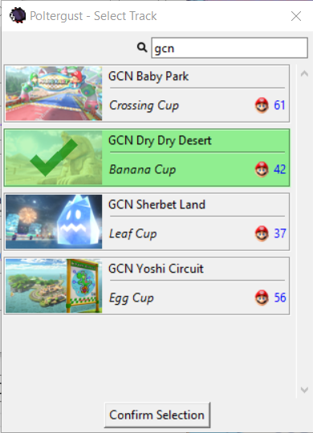
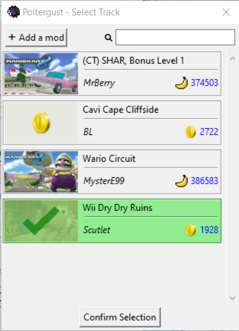
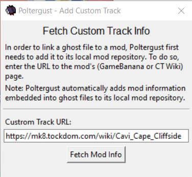

# Poltergust
   

Poltergust is a Mario Kart 8 U (Staff) Ghost Data visualization, extraction, and conversion tool. Mario Kart 8 Deluxe is not actively supported. Contributions to code and/or documentation are always welcome.

> Documentation on the Mario Kart 8 ghost files format can be found on the [MK8 CT Wiki](https://mk8.tockdom.com/wiki/Ghost_Data_(File_Format)).

## DISCLAIMER
This tool supports modification of ghost files, or otherwise aids in describing the file format to allow someone to perform such modifications themselves. **Under no circumstances should you upload any ghost file that was modified by this tool to the Nintendo servers**, nor should you pretend that a modified run was performed legitimately. Doing so will most likely result in a straight up ban. More importantly, there is no pride to take in cheating. Do **not** act like a doofus and ignore this disclaimer.

## Screenshots

More Screenshots

 

# Features
Poltergust supports staff ghost files, player ghost files, and *downloaded ghost files.

- **Previewing**: Preview player name, flag, motion control usage, character, vehicle combination, total & lap times, and track slot.
- **Conversion**: Convert player ghosts and downloaded ghosts to staff ghosts. Convert player ghosts and staff ghosts to downloaded ghosts.
- **Editing**: Change the ghost slot of downloaded ghosts. Change the track slot of any ghost.
> Each downloaded ghost occupies one of sixteen available "slots". There is a limit of four downloaded ghosts per track per game save (five if no player ghost exists for it), for a total of 16 per game save. No two ghosts can occupy the same ghost slot, even if they were set on different tracks.
- **Extraction**: Extract Mii Data.
- **Custom Tracks**: Ghosts can be linked to a specific custom track uploaded to the [CT Wiki](https://mk8.tockdom.com/wiki/Main_Page) or [GameBanana](https://gamebanana.com/games/5709)

> Poltergust stores custom track information locally. When ghost files linked to a custom track are loaded, the custom track information is automatically added to this local storage. Custom tracks can also be added manually through Poltergust's _Custom Track Manager_, and doing so is required when a mod author wishes to link their (staff) ghost to their custom track.

# How to use custom ghosts
_This is a work in progress_

Injecting custom ghosts into the game is a bit of a hassle, especially on real hardware. Note that it is **not** possible to load custom staff ghosts through _CEMU Graphics packs_ (for emulator) or _SDCaffiine_ (for real hardware).

## Staff Ghosts
### Emulator
1. Navigate to `/content/ghost/slow` in the game's source. For DLC tracks, navigate to the relevant update folder instead.
1. Locate the the Nintendo staff ghost occupying the same track slot. The relevant Nintendo staff ghost starts with the same six characters as the custom staff ghost.
1. Delete* the Nintendo staff ghost, and place the custom staff ghost there.

*Rather then deleting, move it to a safe location so it can be restored later on.

> Alternatively, staff ghosts can be directly placed in `mlc\usr\title\0005000e\1010ed00\content\ghost\slow`. The exact implications of this are still unknown.

### Real Hardware
_No known methods. CafeLoader might work._

## Player/Downloaded Ghosts
1. Add the ghost files to one of the users' save files. Make sure no more than four downloaded ghosts exist per track slot.
1. On real hardware, modified save files can be loaded through _[SaveMii](https://apps.fortheusers.org/wiiu/savemii_mod)_

# How to Run
Navigate to the [releases](https://github.com/Scutlet/mk8-poltergust/releases) and search for the latest one. If you're running Windows, you can grab the executable that's included there. These are automatically and directly built from the source code. Note that you'll likely get a Windows Defender popup when attempting to run the tool for the first time this way.

If you're running MacOS or Linux, or if you don't want to run random executables from the internet, you will have to run the tool directly from source (see below).

## Running from Source
Running from source can be done as follows:
1. Navigate to the [releases](https://github.com/Scutlet/mk8-poltergust/releases), and download the latest source code (either the `zip` or `tar.gz`).
1. Install the latest version of [Python 3.10](https://www.python.org/downloads/).
1. Open up a terminal of choice, and navigate to the place where you extracted the source code.
1. Create a new virtual environment using `python -m venv venv`.
1. Activate the newly created virtual environment using `venv\Scripts\activate.bat` (Windows CMD), `venv\Scripts\Activate.ps1` (Windows Powershell), or `source venv/bin/activate` (MacOS or Linux).
1. Install the tool's dependencies using `pip install -r requirements.txt`.
1. Run the tool using `python poltergust.py`.

If you ever want to re-run the tool after closing your terminal, you'll need to repeat steps 3, 5 and 7. You can skip the other steps.

# Future Plans
- **Ghost Manager**: Getting custom (staff) ghosts into the game is a bit of a hassle. It is also difficult to see what ghosts are currently in use without opening and checking them one-by-one. The process of ghost injection can be streamlined (especially for emulator), possibly through "ghost packs", which can then be created and loaded by Poltergust.
- **Additional verification** (Filename vs content): Some information is present in both the ghost's filename and its contents. Although in most cases it won't matter if these two don't match up (the filename takes presence mostly), there can sometimes be issues. For example, if the character does not match up, then animations can break when viewing the replay. See the note below.
- **Editing**: At least the player name and flag should be editable. Runs recorded on the CEMU emulator fail to add the correct flag. It also adds a bogus name (consisting of several types of question mark charaters) if using the default Mii data. Likewise, runs recorded on a real Wii U may use a Mii name that a player may not want to expose elsewhere.
- **Character-specific vehicle parts**: Some vehicle parts are coloured differently based on the character that drives it. This is not reflected in the current UI.
- Support for **MKTV replays**. [Their format](https://mk8.tockdom.com/wiki/MKTV_Replay_(File_Format)) has been mostly decoded.

## What about Mario Kart 8 Deluxe?
Deluxe uses an almost-identical format to Mario Kart 8 U. At this point in time I have no intentions of providing support for Deluxe ghosts. However, you are welcome to contribute to provide support for them.

> To be specific, it switches to a Little Endian format (like almost everything in Deluxe), and gets rid of the long filenames (from which Poltergust currently fetches most its information) for player ghosts. There's also a few more snags, such as an additional ghost list file (See [MK8Leaderboards](https://github.com/Dinostraw/MK8Leaderboards/commits/master) for more details).

Images for tracks, characters, and vehicle parts from Deluxe are already present in this repository, and have even already been properly mapped (though IDs between Wii U and Deluxe do not always match up directly). Tracks images from Wave I of the Booster Course Pass are the latest ones that are present here.

# A quick note on Mario Kart 8 Ghost Data
Mario Kart 8 Ghost Data functions differently from earlier titles. In Mario Kart Wii, ghosts mimicked controller inputs to create an identical race. This could in rare cases cause desyncs, meaning that the ghost would behave differently than how the player actually raced originally.

This was fixed in Mario Kart 8, as ghost replays are no longer based on controller inputs, but instead (or also?) store the ghost's location. For example, placing ghost data from Toad Harbour over Rainbow Road will show the ghost racing through the air, following the course layout of Toad Harbour and ignoring collisions and the like from Rainbow Road entirely.

The filename of a ghost stores information such as lap times, character played, player name, player flag, etc. The information on the summary screen (i.e., the screen that is seen before watching a ghost replay) is taken directly from here. All this information is _also_ stored inside the ghost file itself. However, this is not actually used in most cases. For example, lap times on the end screen (after racing the ghost) are taken from the file contents, whereas the character and vehicle combination are still taken from the filename.

Mii data is stored inside ghost files, although it is only really used for displaying the player's name during a ghost race and on the end screen.

Ghost files were changed a little in version 4 of the game, where <small>GCN</small> Baby Park was added to the game. This track features seven laps that need to be stored in a ghost file name, whereas previously there was only space for at most five laps (space for two were unused). Hence, the filename of ghost files was extended in version 4 of the game.

> Poltergust also injects some information in some pieces of padding of the ghost file to be able to link a ghost to a specific custom track. This should not modify the ghost file itself.

# CREDITS
## B_squo
B_squo provided the initial information on Mii data inside ghost files [in a Tweet](https://twitter.com/b_squo/status/1412392477080834056). This proved to be correct, as this data can be opened in [a Mii viewer](https://kazuki-4ys.github.io/web_apps/MiiInfoEditorCTR/).[CRC-16 XMODEM](https://crccalc.com/) checksum is used to ensure Mii data is not corrupted in that game.

It turned out Mario Kart 8 uses the exact same checksum. Directly editing Mii data _without updating this checksum_ causes a crash.

## lonemoonHD and Cole
lonemoonHD and Cole already independently confirmed the filename format for ghosts earlier on [in a GBATemp thread](https://gbatemp.net/threads/post-your-wiiu-cheat-codes-here.395443/page-454#post-8640417). Furthermore, they provided crucial insights in that same GBATemp thread regarding the difference between staff ghost data and player ghost data: the header.

Copying a player ghost into a staff ghost without removing the player ghost header first caused the game to crash, but completely getting rid of this header and _then_ copying file contents over works completely fine. This provided an entrypoint for custom staff ghosts.

## MK8Leaderboards (Dinostraw)
Starting May 17th 2022, Dinostraw started work on [a Leaderboards visualisation tool](https://github.com/Dinostraw/MK8Leaderboards/commits/master). It contains detailed documentation on the filename and file contents format, written independently from this tool. It provided crucial insights for downloaded ghosts as well as character variants (like Blue Yoshi), support for which was integrated into Poltergust only because of those findings.

## Spriters Resource
Character, flag, track, and vehicle part images were taken from the Spriters Resource, and originally ripped by Random Talking Bush and Ink_Larry.
